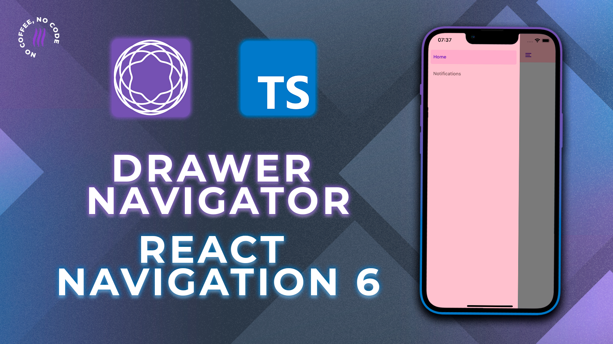

<h2> React Navigation 6 | Drawer Navigator e TypeScript

</h2>

 

Aprenda a configurar e utilizar a biblioteca mais famosa de navegação para aplicativos React Native e Expo: **React Navigation**.

Este projeto foi construído no vídeo sobre React Navigation no canal da Coffstack. [Acesse o tutorial em nosso canal no YouTube clicando aqui!](https://youtu.be/w6oHLMjeoec).

## O que você aprenderá?

- Configurar o [React Navigation](https://reactnavigation.org/docs/getting-started)
- Configurar a parte Native Android e IOS
- Criar um [Drawer Navigator](https://reactnavigation.org/docs/drawer-based-navigation/) (Menu Gaveta)
- Corrigir o erro da biblioteca [react-native-reanimated](https://docs.swmansion.com/react-native-reanimated/docs/fundamentals/installation/)
- Criar um [Stack Navigator](https://reactnavigation.org/docs/native-stack-navigator/)
- Aplicar o conceito de [Nesting Navigators](https://reactnavigation.org/docs/nesting-navigators/)
- Customizar o Drawer Navigator
- Configurar o [TypeScript nas Telas e Hooks](https://reactnavigation.org/docs/typescript/).
